# Rondelle

**La régie télé de vos matchs de hockey.** Rondelle ajoute par-dessus votre match des graphiques
façon télé (et façon jeu vidéo) aux couleurs de votre équipe : fil des actions, célébration des buts
avec le klaxon de l'équipe, prison des pénalités, stats pendant les pubs, son baissé pendant les
pauses. Elle marche avec les 32 équipes de la LNH, que vous regardiez avec votre abonnement télé (RDS,
TVA Sports, Sportsnet, TSN…) ou sur un site web. Interface en français ou en anglais.

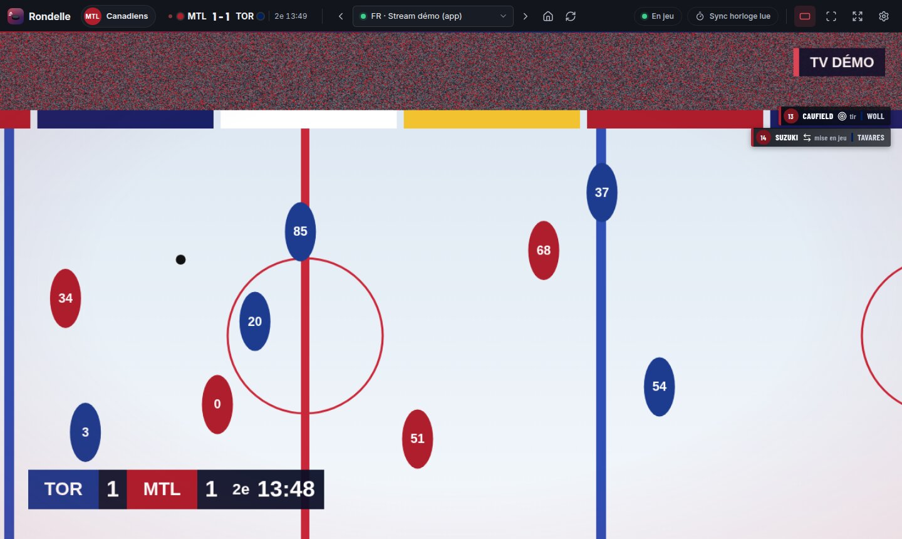

> Application indépendante, non affiliée à la LNH ni à ses équipes. Rondelle ne fournit aucun flux
> vidéo : elle se pose sur ce que vous regardez.

## Sommaire

- [Deux façons de regarder](#deux-façons-de-regarder)
- [Ce que fait la régie](#ce-que-fait-la-régie)
- [Installation](#installation)
- [Premier match](#premier-match)
- [Votre équipe, ses couleurs, ses joueurs](#votre-équipe-ses-couleurs-ses-joueurs)
- [Klaxons et chansons de but](#klaxons-et-chansons-de-but)
- [Le stream ne se lance pas](#le-stream-ne-se-lance-pas)
- [Raccourcis](#raccourcis)
- [Confidentialité](#confidentialité)
- [Pour les développeurs](#pour-les-développeurs)

## Deux façons de regarder

| | **Surcouche** (abonnement télé) | **Lecteur intégré** (site web) |
|---|---|---|
| Pour qui | Vous regardez RDS, TVA Sports, Sportsnet, TSN, Prime Video… avec votre fournisseur télé (Vidéotron, Bell, Rogers, Cogeco…), dans votre navigateur ou l'appli du fournisseur. | Vous regardez sur un site web (OnHockey.tv par défaut, ou un autre). |
| Comment | Mettez le match en plein écran. Rondelle pose par-dessus une fenêtre **transparente** que les clics traversent, regarde l'écran (tableau de score) et écoute le son. | Le site s'ouvre dans Rondelle : choix du stream, pop-ups bloquées, bascule si le stream tombe. |
| Vidéo protégée (DRM) | Aucun problème : Rondelle ne touche pas à la vidéo. | Impossible à lire dans l'app : Rondelle le détecte et propose la surcouche. |
| Son pendant les pubs | Baisse le volume de votre navigateur (ou de tout le PC), via le mélangeur de Windows. | Baisse le son du stream, boost sur l'action. |

Vous choisissez à l'accueil, et pouvez changer à tout moment (Réglages › Général).

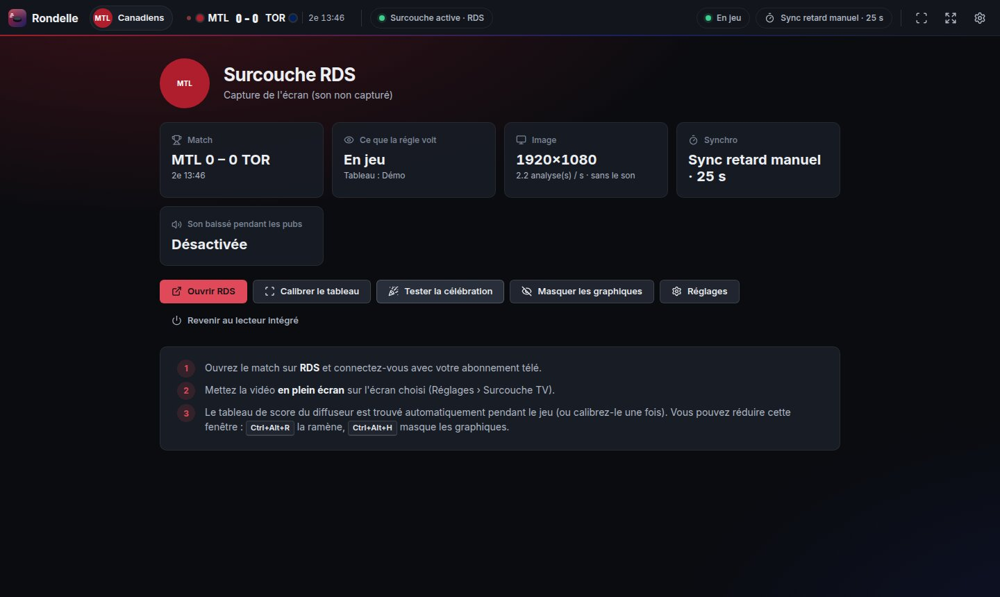

## Ce que fait la régie

| | |
|---|---|
| **Fil des actions** | En haut à droite, petit et discret comme le fil des éliminations d'un jeu vidéo : tirs, tirs ratés, mises en jeu, mises en échec, tirs bloqués, revirements. Joueurs en photo, en nom seul ou en **tête émoji** ; toutes les actions ou celles de votre équipe seulement. |
| **Buts de votre équipe** | « BUT ! » plein écran aux couleurs de l'équipe, carte du marqueur (son 12e but de la saison, aides), confettis, **klaxon et chanson de l'équipe**. |
| **Buts adverses** | La même mise en scène, mais triste : image qui se ternit, pluie, « BUT » qui s'effondre et trombone désolé (ou un simple bandeau, ou rien : Réglages › Graphiques). |
| **Pénalités** | Les barreaux de la **prison** tombent sur le joueur puni (« Au cachot ! »), puis une petite cellule reste en coin avec le temps de punition qui défile ; libéré plus tôt si l'adversaire marque en avantage numérique. |
| **Action serrée** | Les bords de l'image prennent la couleur de l'équipe et battent comme un cœur ; le son monte un peu (lecteur intégré). |
| **Pauses publicitaires** | Pendant les **vraies pubs** seulement, le son baisse et une « émission » recouvre la pub : le match en chiffres, **le but à la loupe** (type de tir, distance, avantage numérique), les **deux équipes face à face**, chacune de son côté (joueurs du match, meneurs, gardiens, « Le saviez-vous ? »), **revue de presse** d'avant-match, face-à-face de la saison, carte des tirs, momentum… |
| **Ralentis et analyses de la chaîne** | Le tableau de score disparaît aussi pendant les reprises, les analyses et l'entracte : la régie les reconnaît (logo de la chaîne, allure de l'image, pause télé annoncée par la LNH) et vous laisse les regarder, sans rien par-dessus. |
| **Zéro divulgâcheur** | Les streams ont 20 secondes à 2 minutes de retard. La régie trouve toute seule le tableau de score et son horloge, les lit et ne montre une action que quand votre image l'atteint. Les fiches des joueurs sont ramenées à « avant ce match » et la revue de presse s'arrête à la mise en jeu. |

| Les couleurs changent avec l'équipe suivie | L'émission des pauses |
|---|---|
| 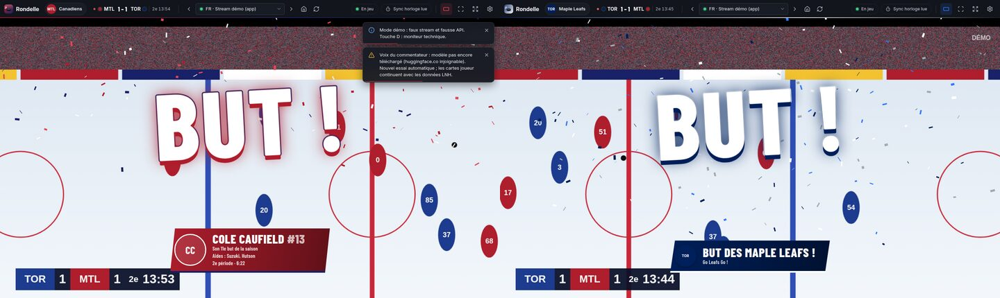 | 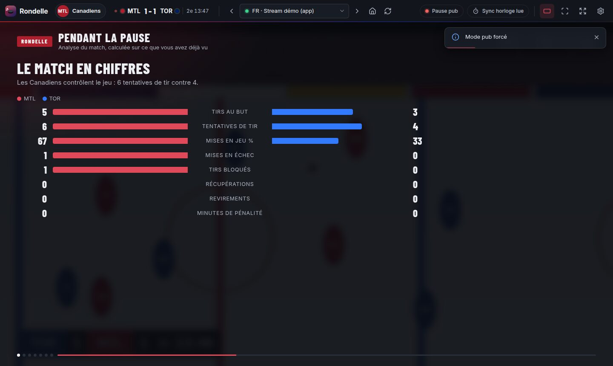 |

| But adverse | Pénalité : au cachot ! |
|---|---|
| 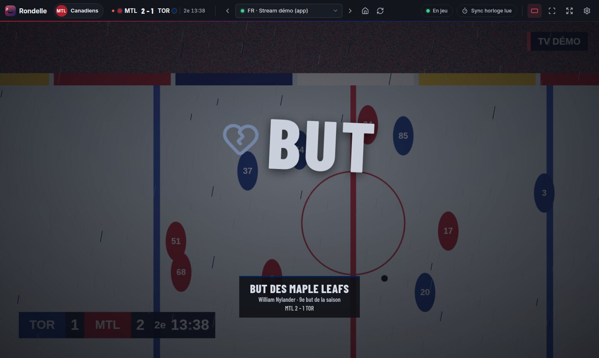 | 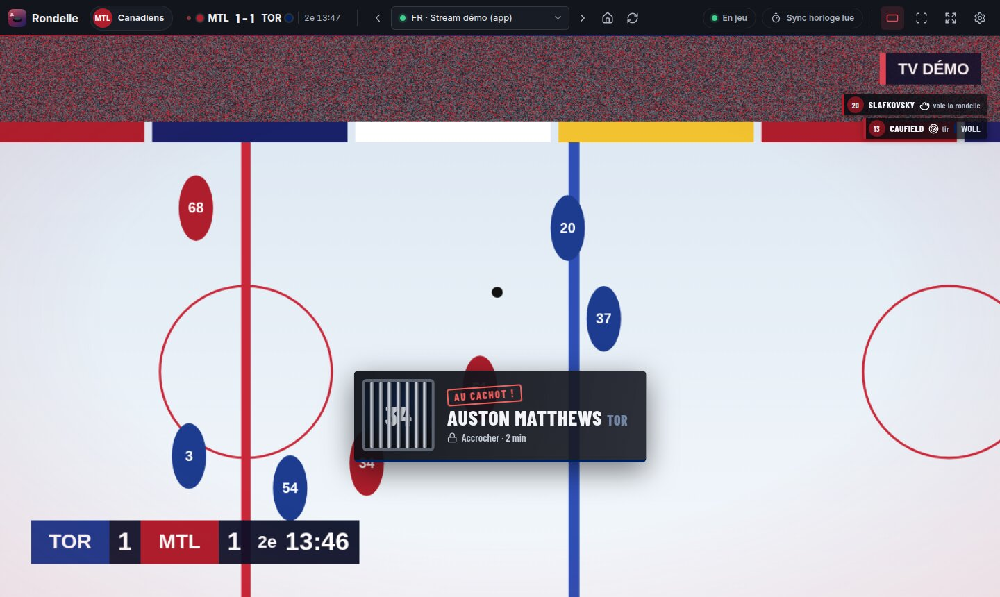 |

| Face à face | Le but à la loupe |
|---|---|
| 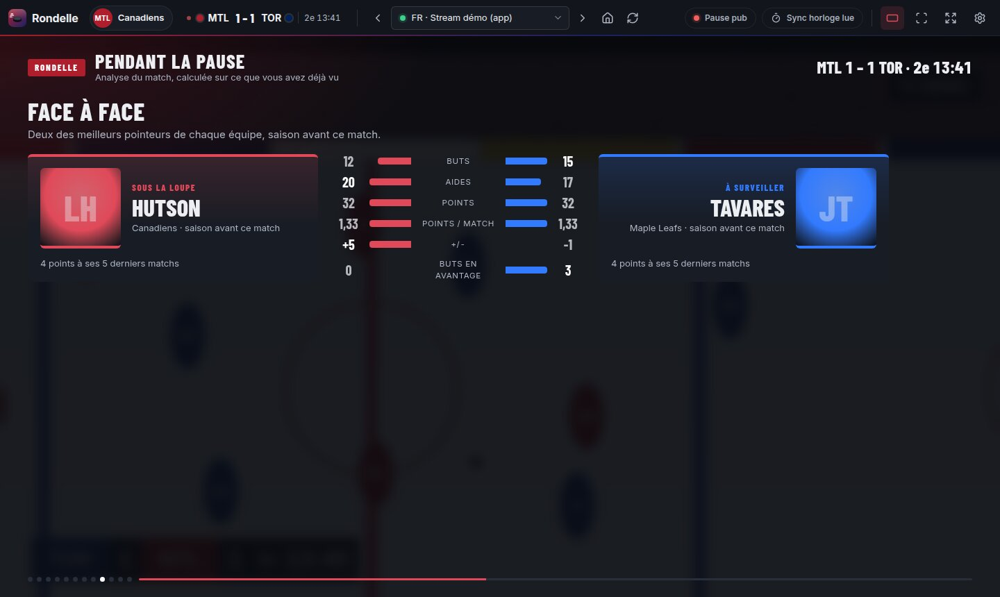 | 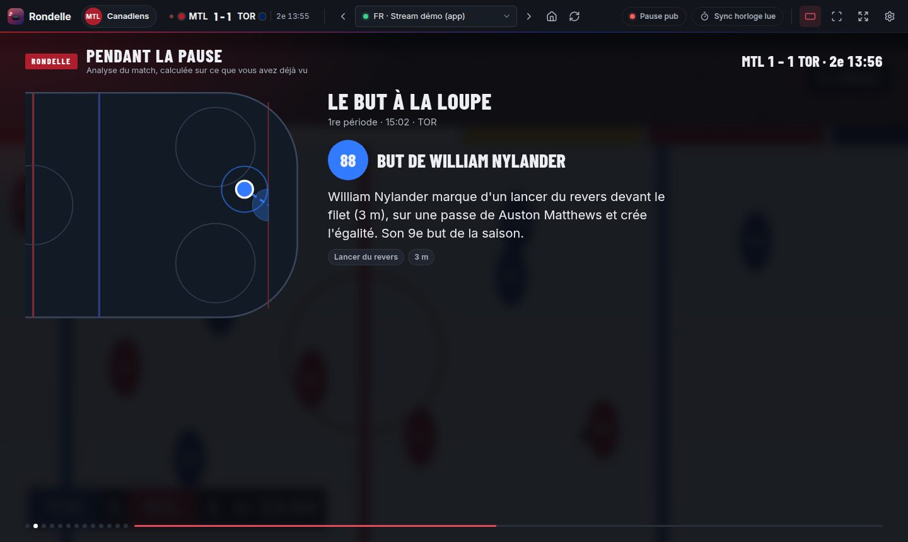 |

## Installation

1. Téléchargez la dernière version : page **Releases** du dépôt (ou, pour la version en cours de
   développement : onglet **Actions** › workflow **Windows** › artefact **Rondelle-Windows**).
2. Lancez `Rondelle-Setup-x.y.z.exe` (installation) ou `Rondelle-Portable-x.y.z.exe` (sans
   installation).
3. Windows SmartScreen peut avertir que l'application n'est pas signée : « Informations
   complémentaires » › « Exécuter quand même ».

Rondelle vérifie chaque jour s'il existe une nouvelle version et vous le propose (désactivable).
Si vous aviez l'ancienne version (« Habs Régie »), vos réglages, tableaux calibrés et têtes émoji
sont repris automatiquement.

## Premier match

1. **Accueil** : choisissez votre équipe, puis votre façon de regarder (surcouche ou lecteur intégré).
2. **Surcouche** : ouvrez le match chez votre diffuseur (bouton « Ouvrir RDS »…), connectez-vous,
   mettez la vidéo en plein écran sur l'écran choisi.
   **Lecteur intégré** : le meilleur stream démarre tout seul au début du match (français d'abord).
3. **Le tableau de score se trouve tout seul** : pendant le jeu, la régie repère le tableau du
   diffuseur et son horloge (les chiffres qui changent chaque seconde), vérifie qu'elle arrive à lire
   le temps, puis s'en sert pour détecter les pubs et se synchroniser sans divulgâcheur. Un profil est
   gardé par diffuseur (RDS, TVA Sports…). Pour ajuster, ou si la chaîne garde son **logo** dans un
   coin de l'image (l'indice le plus sûr pour distinguer une vraie pub d'un ralenti), calibrez à la
   main : bouton Calibrer, ou `C`.
4. **Plein écran** : le bouton plein écran du lecteur (ou `F`) met **le lecteur** en plein écran,
   pas la fenêtre avec le lecteur tout petit dedans ; les graphiques restent par-dessus.

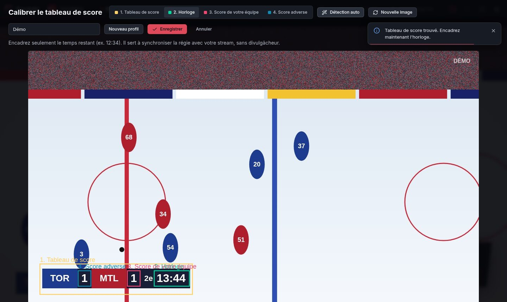

Chaque réglage est expliqué dans une **bulle (i)** au survol. Les réglages sont rangés en rubriques :
Général, Lecteur intégré, Surcouche TV, Son, Graphiques, Pauses pub, Synchro & tableau, Effectifs &
émojis, Raccourcis, Avancé, À propos.

- **Langue** (Général) : automatique (celle de Windows), français ou anglais.
- **Exporter / importer les réglages** (Avancé) : un fichier `.json` à garder ou à copier sur un autre
  PC (équipe, tableaux calibrés, streams ajoutés, sons d'équipe…).

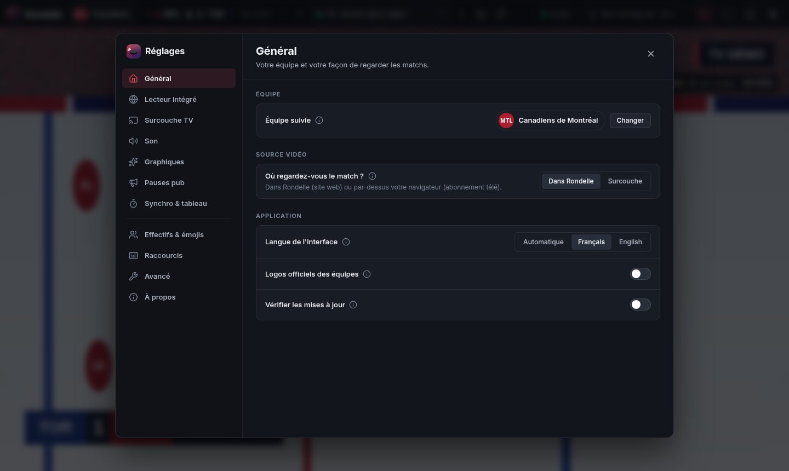

## Votre équipe, ses couleurs, ses joueurs

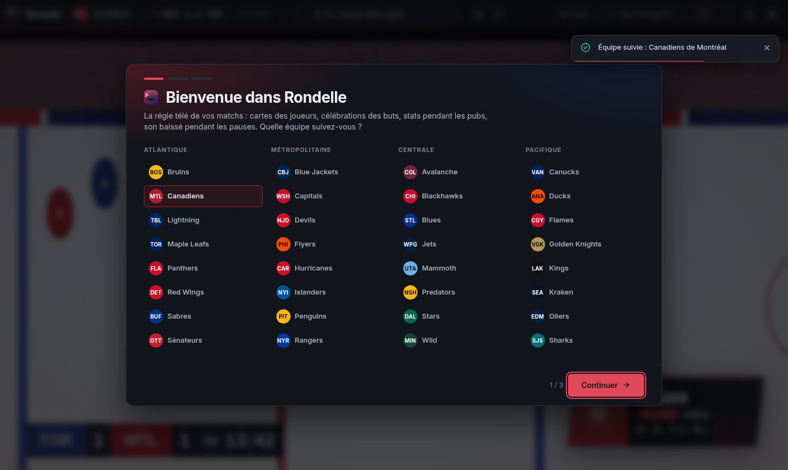

- **Les 32 équipes** (saison 2026-27), rangées par division. L'équipe suivie donne sa direction
  artistique à toute l'application : boutons, barre, célébration, confettis, émission des pauses.
  Quand les deux équipes ont des couleurs proches (Canadiens–Red Wings), l'adversaire prend une autre
  teinte de sa marque dans les graphiques.
- **Logos officiels** chargés depuis les serveurs publics de la LNH puis gardés en cache (jamais
  inclus dans l'application) ; sans connexion, des pastilles aux couleurs des équipes les remplacent.
- **Effectifs & émojis** (Réglages) : l'alignement actuel de n'importe quelle équipe, et la création
  des **têtes émoji** pour une équipe ou les 32 d'un coup. Elles sont fabriquées sur votre ordinateur à
  partir des photos officielles (visage détouré, aplats de couleur, contour, numéro) et enregistrées en
  PNG transparents dans `Images\Rondelle\Têtes <équipe> 2026-27\`. Un joueur sans photo reçoit un casque
  aux couleurs de son équipe.

Dans le fil des actions, chaque joueur apparaît au choix avec sa photo, son nom seulement ou sa tête
émoji (Réglages › Graphiques).

## Klaxons et chansons de but

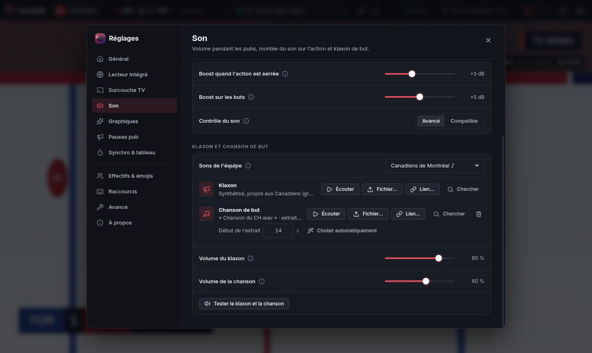

- **Chaque équipe a son klaxon**, synthétisé par Rondelle : corne de navire, accord de locomotive,
  klaxon de camion, corne de brume, grosse corne d'aréna ou sirène, chacun avec son accord et son
  rythme (et un coup de canon pour Columbus).
- **Les vrais klaxons et chansons de but ne sont pas inclus** : ce sont des enregistrements protégés
  par le droit d'auteur. Dans Réglages › Son › Sons de l'équipe, importez-les pour n'importe quelle
  équipe : « Fichier… » (mp3, ogg, wav, m4a…) ou « Lien… » (lien direct vers un fichier audio).
  « Chercher » ouvre une recherche dans votre navigateur pour trouver le son.
- Pour une chanson, Rondelle garde **l'extrait de 15 secondes le plus connu** : le refrain, c'est-à-dire
  le passage le plus fort et le plus rythmé, hors intro et fin en fondu. Vous pouvez déplacer le début
  de l'extrait. Pour un klaxon, la lecture part de la première attaque.
- Les sons sont copiés dans le dossier de Rondelle : rien ne casse si le fichier d'origine est déplacé.

## Le stream ne se lance pas

En lecteur intégré, Rondelle surveille le lecteur et réagit seule :

- **Erreur du lecteur** (« Impossible de lire la vidéo… Error code: hls:networkError_manifestLoadError »
  ou `manifestParsingError`) : elle recharge la page, puis réessaie **sans bloqueur de pubs** pour ce
  site (retenu si la vidéo démarre : certains lecteurs refusent de démarrer sans leurs pubs), puis passe
  au stream suivant. Le bloqueur ne touche jamais au flux vidéo lui-même.
- **La vraie cause est affichée** : accès refusé par le serveur (403), stream terminé (404), serveur
  injoignable, page web reçue à la place de la vidéo… Un serveur injoignable vient souvent du stream
  lui-même : essayez-en un autre, ou passez par votre abonnement télé (surcouche).
- **Vidéo protégée (DRM)** : elle ne peut pas être lue dans l'app ; Rondelle propose de l'ouvrir dans
  votre navigateur et de passer en surcouche.
- Rien ne démarre après 15 s : une notification propose ▶ Lecture, sans bloqueur, stream suivant,
  ouvrir dans le navigateur, **Copier le diagnostic** (à coller dans une issue GitHub).

## Raccourcis

| Touche | Action | Touche | Action |
|---|---|---|---|
| `F` | Plein écran + mode théâtre | `C` | Calibrer le tableau de score |
| `T` | Mode théâtre | `G` | Tester la célébration |
| `N` / `P` | Stream suivant / précédent | `H` | Masquer / afficher les graphiques |
| `M` | Pub : auto › forcée › match forcé | `D` | Moniteur technique |
| `A` | Masquer l'émission jusqu'à la fin de la pause | `S` | Réglages |
| `+` / `−` | Retard du stream (mode manuel) | `Échap` | Quitter le plein écran |

En surcouche, partout dans Windows : `Ctrl+Alt+H` masquer les graphiques, `Ctrl+Alt+M` mode pub,
`Ctrl+Alt+A` masquer l'émission, `Ctrl+Alt+G` tester la célébration, `Ctrl+Alt+R` ramener le panneau
Rondelle.

## Confidentialité

- Analyse de l'image et du son, lecture de l'horloge et têtes émoji fonctionnent **sur votre
  ordinateur** : aucune image ni aucun son n'est envoyé.
- Rondelle contacte seulement : l'API publique de la LNH (`api-web.nhle.com`, photos et logos sur
  `assets.nhle.com`), Google Actualités pendant les pauses pour la revue de presse (titres seulement ;
  désactivable dans Réglages › Pauses pub), GitHub une fois par jour pour les mises à jour, les liens
  de sons que vous collez vous-même, et bien sûr le site que vous regardez.
- Réglages et journal : `%APPDATA%\Rondelle` (Réglages › Avancé › Dossier des données).

## Pour les développeurs

Il faut [Node.js](https://nodejs.org) 22 ou plus.

```bash
npm install                 # installe et copie dans vendor/ les polices et les icônes
npm start                   # l'application
npm run start:demo          # démo du lecteur intégré (faux match, sans internet)
npm run start:overlay-demo  # démo de la surcouche (faux « navigateur » plein écran dessous)
npm run dist:win            # installateur et version portable dans dist/
```

Publier une version : `npm version x.y.z` puis `git push --tags` ; le workflow GitHub Actions
fabrique les `.exe` et crée la release que Rondelle proposera en mise à jour. Le nom de l'application
se change en un seul endroit : `src/shared/brand.js` (et `productName` dans `package.json`).

```
src/main/        process Electron : fenêtres, session du stream (bloqueur, pop-ups), surcouche
                 (overlay.js), volume Windows (systemAudio.js), réglages, mises à jour
src/agent/       injecté dans chaque frame du lecteur intégré : vidéo, son, vignettes, erreurs
src/renderer/    interface : app.js (fenêtre principale), overlayApp.js (fenêtre de surcouche),
                 director.js (la régie), autoCalibrate.js (tableau trouvé tout seul), capture/
                 (écran capturé), ui/ (accueil, effectifs, bulles), horn.js (klaxons),
                 styles.css (charte et jetons)
src/shared/      logique pure et testée : synchro, pubs (vraies pubs / ralentis), vision, tension,
                 stats, analyses et anecdotes (insights.js), équipes et thèmes, klaxons (horns.js),
                 streams, erreurs de lecture, langue (i18n.js, traductions dans i18n-en.js)
```

Tests :

```bash
npm test                     # logique (49 tests, dont les traductions)
xvfb-run -a npm run test:e2e # bout en bout (sous Windows : npm run test:e2e)
```

Les tests de bout en bout lancent la vraie application : régie en démo (pubs, pub blanche, et ralentis
qui n'en sont pas, avec ou sans logo de chaîne : `NOLOGO=1` ; fil des actions, prison, but adverse),
**buts à l'heure** (célébration et but adverse au moment où l'image les montre, stream de 90 s de
retard calibré ou non, stream en avance sur l'API), interface (réglages, bulles, changement d'équipe,
accueil, calibration), surcouche (fenêtre transparente, capture, commandes du panneau), lecteurs
pièges, plein écran d'un lecteur imbriqué dans des iframes de trois domaines, erreurs HLS (403, page
web au lieu du flux), têtes émoji, émission des pauses (toutes les séquences, aucun article d'après la
mise en jeu), export / import des réglages et sons d'équipe (fichier, lien direct, extrait de 15 s).
La CI Windows vérifie aussi que l'assistant de volume compile.

Traductions : le français est la langue source ; `npm run i18n` liste les textes de l'interface qui
n'ont pas encore de traduction anglaise (`src/shared/i18n-en.js`).

Licence MIT (voir `LICENSE`). Composants : Electron (MIT), Ghostery Adblocker (MPL-2.0), Tesseract.js
(Apache-2.0), polices Inter et Barlow Condensed (OFL), icônes Lucide (ISC).
