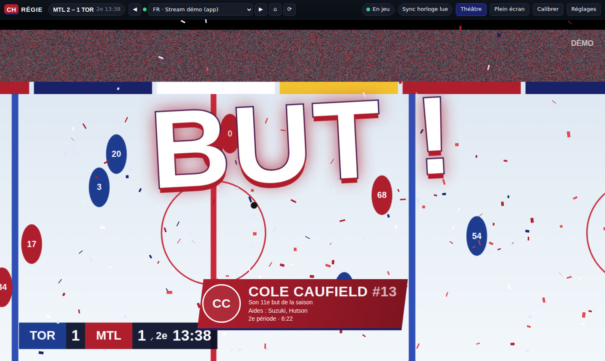
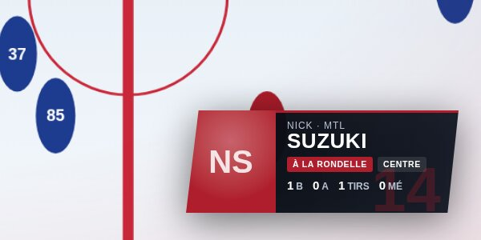
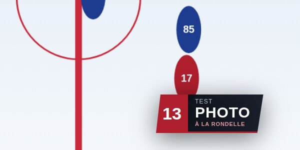
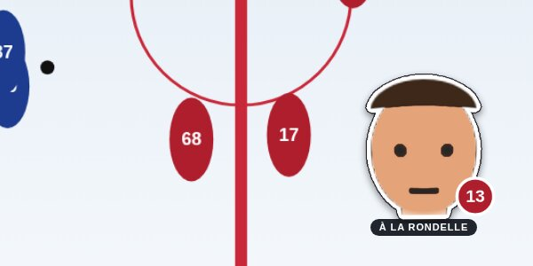
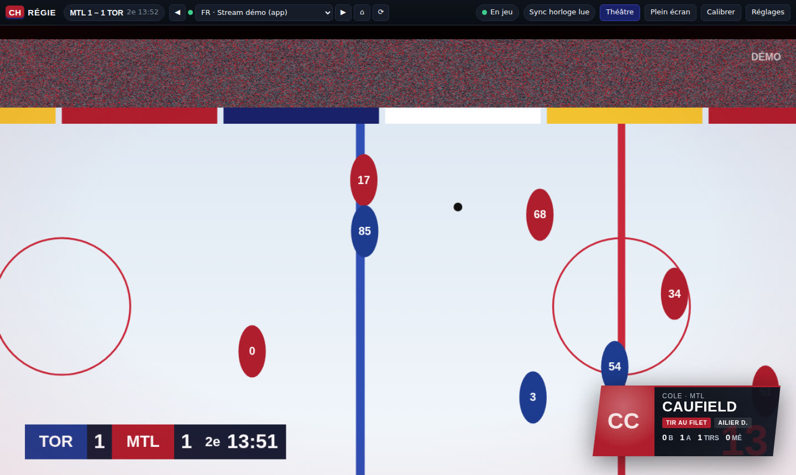
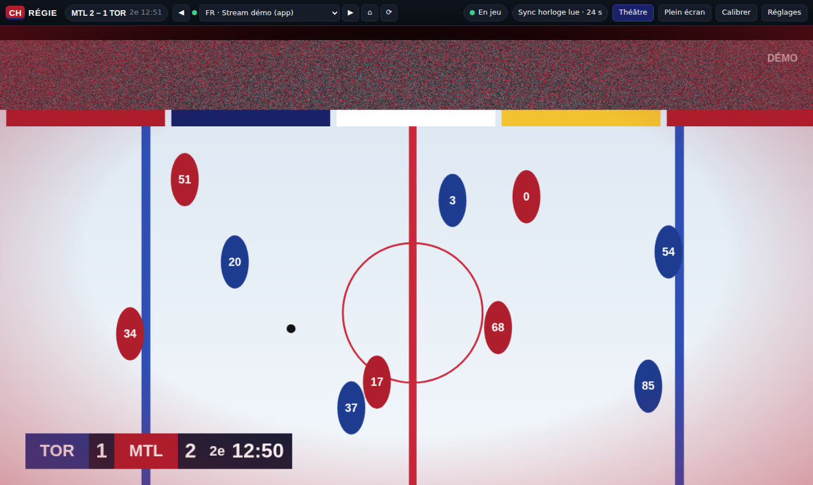
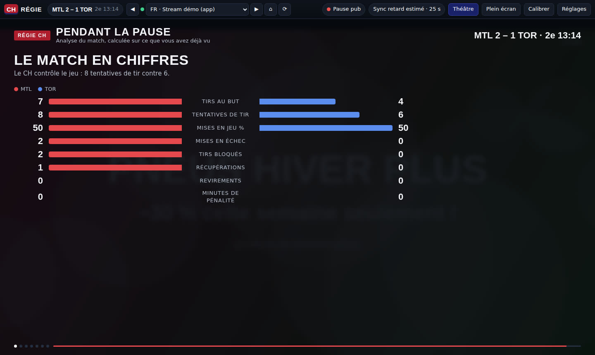
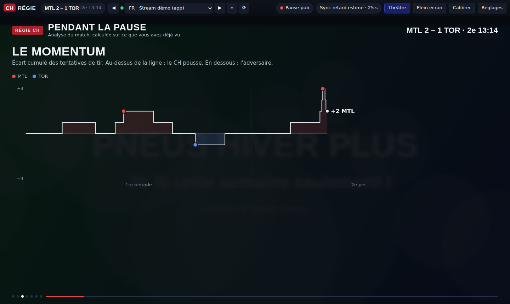
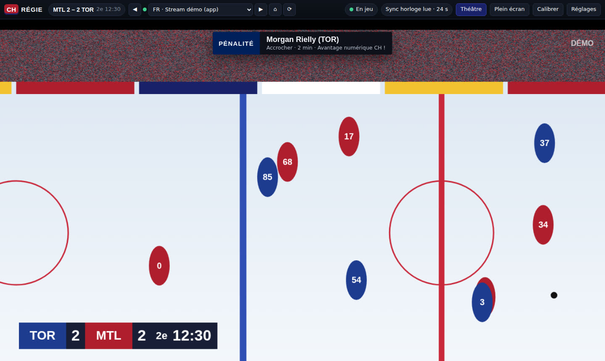

# Habs Régie

Application Windows pour regarder les matchs des **Canadiens de Montréal** (ou de n'importe quelle
autre équipe de la LNH) sur OnHockey.tv avec une « régie » en surcouche : elle gère le stream à votre
place et ajoute des graphiques façon télé (et façon FIFA) par-dessus l'image.



## Ce que fait l'application

### Gestion du stream

| Demande | Ce qui se passe |
|---|---|
| Baisser le son pendant les pubs | Le tableau de score du diffuseur disparaît pendant les pubs : la régie le surveille et baisse le son du stream (−24 dB par défaut, ou coupure complète). |
| Remettre le son à la reprise | Dès que le tableau de score revient, le son remonte en douceur. |
| Fermer pubs et pop-ups | Les pop-ups et les nouveaux onglets sont refusés, les redirections publicitaires sont bloquées, un bloqueur de pubs (listes EasyList via Ghostery) filtre la page et les calques invisibles posés sur le lecteur pour piéger les clics sont retirés. Le stream reste au premier plan. |
| Stream en panne → suivant | La vidéo est surveillée en continu (bloquée, en erreur, image figée, page morte). En cas de panne, la régie passe au stream suivant du match, **en français d'abord** (RDS, TVA Sports), puis en anglais. Un stream en panne n'est pas réessayé avant 3 minutes. Tant qu'un stream n'a jamais démarré, la régie ne zappe pas dans votre dos : après 15 s, elle propose de l'aide (voir [Le stream ne se lance pas](#le-stream-ne-se-lance-pas)). |
| Trouver le match | La page OnHockey.tv est lue pour y trouver les liens du match de l'équipe suivie (le CH par défaut, ou une autre : Réglages → Équipe). Le meilleur stream démarre tout seul quand le match commence. Vous pouvez aussi ajouter vos propres liens. |

### La régie

| Demande | Ce qui se passe |
|---|---|
| Joueur à la rondelle en bas à droite | Le joueur apparaît en bas à droite, au choix en **carte** (photo, numéro, nom, stats du match), en **nom seul** (plaque façon FIFA) ou en **tête émoji**. Il est reconnu de deux façons : par **la voix du commentateur** (français ou anglais : « Suzuki s'échappe… », « Caufield shoots ») et par chaque action enregistrée par la LNH (mise en jeu, tir, mise en échec…). Voir [Qui a la rondelle ?](#qui-a-la-rondelle-). |
| But ou action serrée → plus de volume, effet de pression | La foule est analysée en direct (le son monte d'un coup), en plus du contexte (tir dangereux, avantage numérique, fin de match serrée, filet désert). L'image prend un halo rouge qui bat comme un cœur et le son monte de quelques dB (avec un limiteur, ça ne sature jamais). |
| Stats pendant les pubs | La pub est recouverte par une « émission » animée : le match en chiffres, carte des tirs, momentum, joueur du match, un joueur sous la loupe (forme récente, saison), les gardiens, les buts. |
| But du CH → célébration et klaxon | « BUT ! » plein écran, flash bleu-blanc-rouge, confettis, carte du marqueur (son 12e but de la saison, aides) et klaxon de but. |
| Optimisé, configurable | Analyse de l'image 2 fois par seconde sur des vignettes de quelques Ko, OCR dans un worker, animations sur la carte graphique uniquement. Tout se règle dans le panneau Réglages (touche `S`). |

### Zéro divulgâcheur

Les streams ont 20 secondes à 2 minutes de retard sur le direct, alors que l'API de la LNH est presque
en direct. Si la régie affichait les actions dès que l'API les annonce, vous verriez le but avant qu'il
arrive sur votre écran.

La régie **lit l'horloge du tableau de score sur l'image du stream** (OCR) et ne montre une action
que quand votre stream atteint ce moment du match. Le score affiché dans la barre du haut et toutes
les stats de l'émission sont aussi calculés uniquement sur ce que vous avez déjà vu. Si l'horloge
n'est pas lisible, la régie utilise le retard mesuré auparavant, ou un retard réglé à la main
(touches `+` / `−`).

## Qui a la rondelle ?



Trois pistes étaient possibles pour savoir quel joueur afficher. Voici pourquoi l'application
écoute le commentateur, en plus des données de la LNH :

| Piste | Verdict |
|---|---|
| **Lire le numéro du chandail sur l'image** | Écartée. Sur un stream 720p compressé, en plan large, un numéro fait 10 à 20 pixels, souvent de dos, de biais ou flou de mouvement : il est illisible la plupart du temps. Il faudrait en plus un modèle de détection lourd qui tourne sans arrêt sur la carte graphique, de quoi faire saccader le stream. |
| **Internet (API de la LNH)** | Gardée, mais insuffisante seule : c'est exact et synchronisé sur votre stream, mais seulement pour les actions enregistrées (tirs, mises en jeu, mises en échec…), soit une toutes les 10 à 20 secondes. Le porteur de la rondelle entre deux actions n'y est pas. |
| **La voix du commentateur** | Retenue. Le commentateur nomme presque toujours le porteur de la rondelle, en français comme en anglais. L'application capte déjà le son du stream (pubs, foule) : un modèle de reconnaissance vocale (Whisper) tourne **sur votre ordinateur**, sans compte ni frais, et ne s'active que pendant le jeu. |

Les deux sources sont combinées : une action LNH reste prioritaire (elle est exacte), la voix comble
les trous entre les actions. La carte affiche alors « À la rondelle ».

Comment la voix est analysée :

- toutes les ~2,5 secondes, les 3,5 dernières secondes de son sont transcrites (avec un
  chevauchement, pour ne pas couper un nom en deux) ;
- les noms sont cherchés dans les alignements **des deux équipes du match**, avec une comparaison
  phonétique qui tolère les prononciations québécoises et anglaises et les erreurs de transcription
  (« Cofield », « Slafko », « Hudson », « Dash » pour Dach…). Deux joueurs du même nom (deux Hughes)
  ne sont jamais devinés ;
- la langue suit celle du stream (RDS, TVA Sports → français ; Sportsnet, TSN → anglais), ou se
  force dans les réglages ;
- en pause publicitaire, entre les périodes ou sans match, la reconnaissance s'arrête.

Réglages → Régie → **Qui a la rondelle ?** (« Voix du commentateur + données LNH » ou « Données LNH
seulement »), et Réglages → **Voix du commentateur** :

| Modèle | Téléchargement unique (processeur / carte graphique) | Pour qui |
|---|---|---|
| Rapide | ~40 Mo / ~120 Mo | PC modeste, sans carte graphique récente |
| **Équilibré** (par défaut) | ~80 Mo / ~200 Mo | La plupart des PC |
| Précis | ~250 Mo / ~600 Mo | Carte graphique récente |

Les tailles sont approximatives. Le modèle se télécharge depuis huggingface.co au premier match (une
notification montre la progression), puis il est gardé sur le disque et tout fonctionne hors ligne.
Le calcul se fait sur la carte graphique (WebGPU) quand elle est disponible, sinon sur le processeur.
Si la voix est trop lente sur votre PC, l'application vous propose le modèle « Rapide ». **Le son ne
quitte jamais votre ordinateur.**

## Affichage du joueur : carte, nom ou tête émoji

Réglages → Régie → **Affichage du joueur** :

| Nom seulement | Tête émoji |
|---|---|
|  |  |

La « Carte » (photo + nom + stats) est montrée plus bas, dans [Mode démo](#mode-démo). La tête émoji
ci-dessus est faite à partir d'un portrait de test ; avec les vraies photos, chaque joueur est
reconnaissable.

**Les têtes émoji** sont fabriquées sur votre ordinateur à partir des photos officielles de la LNH
(assets.nhle.com) : visage détouré et arrondi, couleurs en aplats, contour encré, bordure
d'autocollant et numéro du joueur. Un joueur sans photo reçoit un casque aux couleurs de son équipe
avec son numéro. Pendant les matchs, elles sont créées à l'avance pour les joueurs qui peuvent être
affichés, puis gardées sur le disque.

Pour avoir **tout le roster de la saison 2026-27** d'un coup : Réglages → **Créer les têtes émoji du
roster**. L'application demande l'alignement actuel à l'API de la LNH (donc toujours à jour après
un échange ou un rappel), crée une tête par joueur et les enregistre en PNG transparents dans
`Images\Habs Régie\Têtes Montréal Canadiens 2026-27\` (le dossier s'ouvre à la fin). Les images ne
sont pas fournies dans le dépôt : les photos de la LNH sont protégées, elles restent donc sur votre
ordinateur, pour votre usage personnel.

## Suivre une autre équipe

Réglages → Équipe → **Équipe suivie** : les 32 équipes de la LNH. La régie cherche alors les streams
du match de cette équipe sur OnHockey.tv, et les célébrations, cartes, stats et la voix suivent ce
match. Si les liens d'un match portent un nom inhabituel, cliquez directement le lien sur la page
(la régie le suit), ou ajoutez des mots-clés dans `extraKeywords` du fichier `config.json`.

## Le stream ne se lance pas

Les causes trouvées en lançant un match d'une autre équipe, et corrigées :

- **Liens bloqués** : les liens des autres matchs pointent souvent vers d'autres sites de lecteurs
  que ceux du CH, et la protection anti-redirection les bloquait. Désormais, tous les liens de la page
  OnHockey.tv sont autorisés, et une page que vous ouvrez vous-même d'un clic l'est toujours.
- **Bouton ▶ retiré** : certains lecteurs posent un bouton ▶ transparent par-dessus la vidéo ; il
  était pris pour un calque publicitaire. Seuls les calques vraiment invisibles (sans image, texte ni
  bouton) qui couvrent au moins la moitié du lecteur sont retirés.
- **Lecteur planté par le bloqueur de pop-ups** : certains lecteurs ouvrent une pop-up au premier clic
  et plantent si elle est refusée. Ils reçoivent maintenant une fausse fenêtre invisible : le lecteur
  continue et aucune pub ne s'ouvre.
- **Zapping trop pressé** : la régie passait au stream suivant pendant le chargement. Elle attend
  maintenant que la vidéo ait démarré une première fois.

Si un lecteur ne démarre toujours pas après 15 secondes, une notification propose : ▶ Lecture,
Réessayer sans bloqueur de pubs (pour ce site seulement), Stream suivant, Ouvrir dans mon navigateur,
Copier le diagnostic. Le diagnostic (Réglages → Dépannage → **Copier le diagnostic**) résume l'état
du stream, des lecteurs détectés, des pop-ups et redirections bloquées et des erreurs : collez-le
dans une issue GitHub pour qu'on puisse corriger le site en cause.

## Installation

### Option 1 : installateur Windows (aucun outil à installer)

Chaque version du code est compilée automatiquement par GitHub Actions :

1. Onglet **Actions** du dépôt → workflow **Windows** → dernière exécution réussie.
2. Téléchargez l'artefact **Habs-Regie-Windows** (un zip).
3. Lancez `Habs-Regie-Setup-x.y.z.exe` (installation) ou `Habs-Regie-Portable-x.y.z.exe` (sans installation).

Windows SmartScreen peut avertir que l'application n'est pas signée : « Informations
complémentaires » → « Exécuter quand même ».

Le modèle de la voix du commentateur n'est pas dans l'installateur : il se télécharge au premier
match (voir [Qui a la rondelle ?](#qui-a-la-rondelle-)).

### Option 2 : depuis le code

Il faut [Node.js](https://nodejs.org) 22 ou plus.

```bash
npm install            # copie aussi le moteur de reconnaissance vocale dans vendor/
npm start              # l'application
npm run start:demo     # le mode démo (faux match, sans internet)
npm run dist:win       # fabrique l'installateur dans dist/
```

## Premier match : 2 minutes de réglage

1. Lancez l'application : OnHockey.tv s'ouvre. Si le match est en cours, le meilleur stream démarre
   tout seul. Sinon, choisissez-le dans la liste en haut (ou cliquez le lien sur la page).
2. **Pendant le jeu**, appuyez sur `C` pour calibrer le tableau de score du diffuseur :
   - « Détection auto » le trouve tout seul (laissez le jeu se dérouler une dizaine de secondes), ou
     encadrez-le à la souris ;
   - encadrez l'horloge (la lecture s'affiche tout de suite pour vérifier) ;
   - encadrez les deux chiffres du score (facultatif) ;
   - enregistrez. Le profil est gardé pour les prochains matchs (un profil par diffuseur : RDS,
     TVA Sports, Sportsnet…).
3. Appuyez sur `F` pour le plein écran. C'est tout.

Sans calibration, l'application fonctionne quand même (pop-ups, bascule de stream, cartes joueurs,
célébrations avec un retard réglé à la main), mais ne détecte pas les pubs toute seule : la touche `M`
bascule alors le mode pub à la main.

## Raccourcis

| Touche | Action |
|---|---|
| `F` | Plein écran + mode théâtre (le lecteur seul, plein cadre) |
| `T` | Mode théâtre |
| `N` / `P` | Stream suivant / précédent |
| `M` | Pub : automatique → forcée → match forcé |
| `+` / `−` | Retard du stream (mode manuel) |
| `C` | Calibrer le tableau de score |
| `G` | Tester la célébration |
| `B` | Relancer la lecture si la vidéo est en pause |
| `H` | Masquer / afficher les surcouches |
| `D` | Moniteur technique (diagnostic) |
| `S` | Réglages |
| `Échap` | Quitter le plein écran / fermer |

Le bouton plein écran du lecteur du site est détourné vers le plein écran de l'application, pour que
la surcouche reste visible.

## Votre propre klaxon

Le klaxon par défaut est synthétisé (aucun enregistrement protégé n'est fourni). Dans
Réglages → Son, choisissez votre fichier : le vrai klaxon du Centre Bell, ou une chanson de but
qui part juste après.

## Mode démo

`npm run start:demo` lance un faux stream (patinoire, tableau de score, reprises, pause pub) et une
fausse API LNH calée dessus : but du CH, pause publicitaire avec l'émission de stats, séquence de
pression, but adverse, pénalité. Votre configuration n'est pas modifiée.

| | |
|---|---|
|  |  |
|  |  |
|  |  |

## Comment ça marche

```
┌──────────────────────── Fenêtre Habs Régie ─────────────────────────┐
│ Barre : match (score vu sur le stream) · streams · sync · réglages  │
│ ┌─────────────────────────── scène ───────────────────────────────┐ │
│ │ <webview> OnHockey.tv / lecteur  ← agent injecté dans chaque    │ │
│ │   (session isolée, bloqueur,        frame : vidéo, son, vignettes│ │
│ │    pop-ups refusées)                 théâtre, anti-calques)     │ │
│ │ surcouche HTML : carte joueur, bandeau, célébration, émission   │ │
│ └─────────────────────────────────────────────────────────────────┘ │
└──────────────────────────────────────────────────────────────────────┘
   vignettes 2×/s ─▶ vision (tableau présent ? image figée ? OCR horloge/score)
   son du stream ─▶ niveau de la foule ─▶ tension ─▶ effet + volume
   son du stream ─▶ 16 kHz ─▶ Whisper (worker, WebGPU/processeur) ─▶ noms ─▶ carte joueur
   API LNH (gratuite, sans clé) ─▶ actions ─▶ horloge du stream ─▶ surcouches
```

- `src/main/` — process Electron : fenêtre, session du stream (bloqueur, pop-ups, redirections),
  accès à l'API LNH, configuration (`%APPDATA%/Habs Régie/config.json`).
- `src/agent/frame-agent.cjs` — injecté dans chaque frame de la page du stream : trouve la vraie
  vidéo, surveille sa santé, fait passer le son par un gain + limiteur (Web Audio), capture de
  petites vignettes, mode théâtre, détournement du plein écran.
- `src/shared/` — la logique pure, testée : synchronisation horloge stream ↔ API, détection des
  pubs, tension, statistiques, lecture de la page OnHockey et classement des streams, règles de
  navigation et de pop-ups (`navPolicy.js`), repérage phonétique des noms (`names.js`), fabrication
  des têtes émoji (`emoji.js`).
- `src/renderer/` — l'interface : la Régie (`director.js`), les surcouches, l'émission des pauses,
  la calibration, les réglages, l'OCR (Tesseract, hors ligne), les têtes émoji (`emojiHeads.js`) et la
  voix du commentateur (`voice/` : transformers.js + ONNX Runtime dans un worker).
- `scripts/vendor.mjs` — copie le moteur de reconnaissance vocale (transformers.js, ONNX Runtime
  WebAssembly) dans `vendor/` après `npm install` et avant la fabrication du paquet.

Sources de données, toutes gratuites et sans clé :
`api-web.nhle.com` (calendrier, play-by-play, alignements, stats des équipes et des joueurs), les photos
`assets.nhle.com` et, une seule fois, le modèle de reconnaissance vocale `huggingface.co`
(onnx-community/whisper).

## Limites honnêtes

- **Le joueur « à la rondelle »** : suivre la rondelle sur l'image d'un stream compressé, en temps
  réel et gratuitement, n'est pas fiable aujourd'hui (et les données de suivi de la LNH ne sont pas
  publiques en direct). La régie combine donc la voix du commentateur et les actions enregistrées
  par la LNH. La voix a 2 à 4 secondes de retard (le temps d'entendre et de transcrire), peut se
  tromper sur un nom mal prononcé ou couvert par la foule, et se tait quand le commentateur parle
  d'autre chose. Les actions LNH, elles, sont exactes mais espacées.
- **Têtes émoji** : elles dépendent des photos officielles. Pour un joueur rappelé dont la photo de
  la saison n'existe pas encore, c'est le casque avec son numéro qui s'affiche.
- **OnHockey.tv** change parfois sa page. La lecture des liens est volontairement souple (mots-clés
  « Montréal / Canadiens / MTL », drapeaux, noms de diffuseurs), mais si un stream manque, ajoutez-le
  dans Réglages → Mes streams, ou cliquez-le directement sur la page : la régie le suit.
- **Détection des pubs** : elle repose sur le tableau de score du diffuseur. Les reprises après un
  but cachent aussi le tableau : la régie attend alors plus longtemps avant de baisser le son.
  L'entracte est traité comme une pause (son baissé, émission de stats).
- **Son « avancé »** : il fonctionne avec la grande majorité des lecteurs (HLS). Si un site protège
  son flux, l'application le détecte et propose le mode « compatible » (volume du lecteur : baisse
  pendant les pubs, mais pas de boost, ni d'analyse de la foule, ni de voix du commentateur : les
  cartes viennent alors des seules données LNH).

## Tests

```bash
npm test                     # logique (synchro, pubs, tension, stats, streams, navigation, noms…)
xvfb-run -a npm run test:e2e # bout en bout (sous Windows : npm run test:e2e)
```

Les tests de bout en bout lancent la vraie application avec de faux sites locaux :

- `e2e-demo` / `e2e-ui` : la régie en mode démo (pubs, cartes, célébration, réglages, calibration) ;
- `e2e-player` : des pages de lecteurs « pièges » (liens vers d'autres sites, bouton ▶ transparent,
  pop-up au premier clic) : le stream doit démarrer ;
- `e2e-heads` : fabrication des têtes émoji, styles « nom » et « tête émoji », export PNG ;
- `e2e-voice` : toute la chaîne de la voix avec un faux modèle Whisper minuscule
  (`test/fixtures/fake-whisper`, recréé par `make_fake_whisper.py`) : son du stream → transcription
  → nom repéré → carte « À la rondelle ». `HABS_E2E_EXE=<exécutable>` teste l'app empaquetée.

## Note

L'application n'héberge ni ne fournit aucun flux : elle affiche le site que vous choisissez et y
ajoute une surcouche. Respectez les conditions de diffusion en vigueur chez vous.
